# US License Plate Results

20 test images. Expand an image below to compare detection and text recognition results. Click any image to see it at full size.

[Project setup and usage](../README.md) · [Saved predictions](detections.json)

## Detection

300 training images; 20 epochs for fine-tuned and from-scratch models.

| YOLOv9-t model | Precision | Recall |
| --- | ---: | ---: |
| Pretrained | 83.3% | 100.0% |
| Fine-tuned | 95.2% | 100.0% |
| From scratch | 83.3% | 25.0% |

**Precision:** how many predicted plates were correct. **Recall:** how many labeled plates were found.

Confidence ≥ 0.25; IoU ≥ 0.50.

## Text recognition

PARSeq-Tiny, fine-tuned for 20 epochs on 277 labeled plate images.

| OCR model | Exact plate accuracy |
| --- | ---: |
| Original OCR | 76.5% (13/17) |
| Fine-tuned OCR | 76.5% (13/17) |

This table tests OCR alone on the same 17 plate images taken from manually labeled boxes. 3 plates without confirmed text are excluded. The whole number must match; case, spaces, and punctuation are ignored. O/0 and I/1 remain distinct.

The examples below use the plate areas found by YOLO. Extra background or missing characters can change the OCR result. ✓ matches the reference; ✗ differs. Unlabeled or unmatched detections have no correctness mark.

## Test images

01 · us_test_001.jpg

**Original image**

**Reference:** 3421

| Pretrained | Fine-tuned | From scratch |
| --- | --- | --- |
| <a href="baseline/annotated/test__us_test_001.jpg.jpg">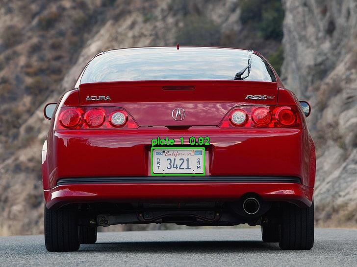</a> |  | <a href="scratch/annotated/test__us_test_001.jpg.jpg">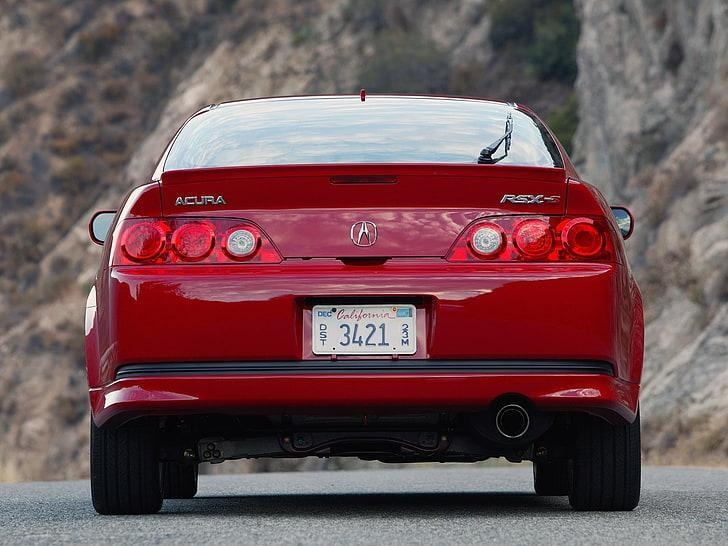</a> |
| 1 detection | 1 detection | 0 detections |

| Detector | Plate image and confidence | Reference | Original OCR | Fine-tuned OCR |
| --- | --- | --- | --- | --- |
| Pretrained | <a href="baseline/crops/test__us_test_001.jpg__plate_01.png">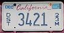</a> #1 · 0.916 | 3421 | 934214 ✗ | 3421 ✓ |
| Fine-tuned | <a href="finetuned/crops/test__us_test_001.jpg__plate_01.png">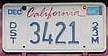</a> #1 · 0.937 | 3421 | F3421 ✗ | 3421 ✓ |
| From scratch | No detections | — | — | — |

02 · us_test_002.jpg

**Original image**

**Reference:** T

| Pretrained | Fine-tuned | From scratch |
| --- | --- | --- |
|  |  |  |
| 1 detection | 1 detection | 1 detection |

| Detector | Plate image and confidence | Reference | Original OCR | Fine-tuned OCR |
| --- | --- | --- | --- | --- |
| Pretrained | <a href="baseline/crops/test__us_test_002.jpg__plate_01.png">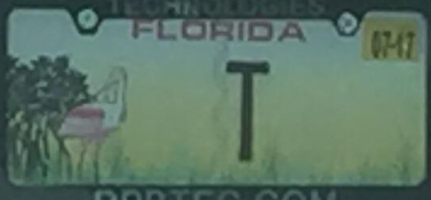</a> #1 · 0.878 | T | MEN ✗ | XIN ✗ |
| Fine-tuned | <a href="finetuned/crops/test__us_test_002.jpg__plate_01.png">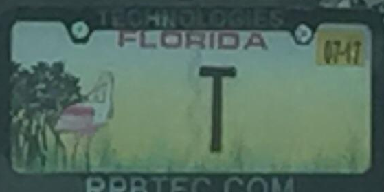</a> #1 · 0.868 | T | NO ✗ | 7 ✗ |
| From scratch | <a href="scratch/crops/test__us_test_002.jpg__plate_01.png">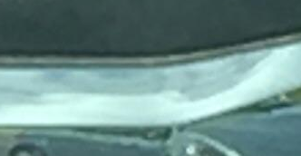</a> #1 · 0.278 | No matching plate | COMPECTION | 1 |

03 · us_test_003.jpg

**Original image**

**Reference:** Not labeled

| Pretrained | Fine-tuned | From scratch |
| --- | --- | --- |
|  | <a href="finetuned/annotated/test__us_test_003.jpg.jpg">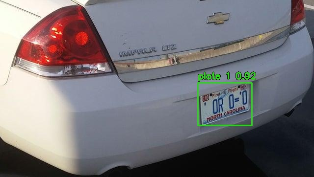</a> |  |
| 1 detection | 1 detection | 0 detections |

| Detector | Plate image and confidence | Reference | Original OCR | Fine-tuned OCR |
| --- | --- | --- | --- | --- |
| Pretrained |  #1 · 0.887 | Not labeled | OROOO | 0R00 |
| Fine-tuned |  #1 · 0.919 | Not labeled | OROO | ORD0 |
| From scratch | No detections | — | — | — |

04 · us_test_004.jpg

**Original image**

**Reference:** Not labeled

| Pretrained | Fine-tuned | From scratch |
| --- | --- | --- |
|  | <a href="finetuned/annotated/test__us_test_004.jpg.jpg">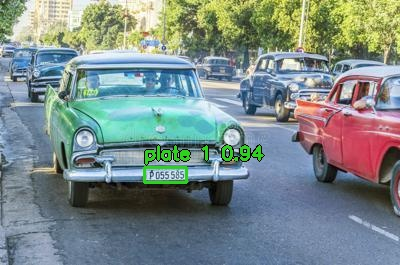</a> |  |
| 1 detection | 1 detection | 0 detections |

| Detector | Plate image and confidence | Reference | Original OCR | Fine-tuned OCR |
| --- | --- | --- | --- | --- |
| Pretrained |  #1 · 0.830 | Not labeled | P055585 | P055585 |
| Fine-tuned |  #1 · 0.940 | Not labeled | P055585 | P055585 |
| From scratch | No detections | — | — | — |

05 · us_test_005.jpg

**Original image**

**Reference:** 5FLR236

| Pretrained | Fine-tuned | From scratch |
| --- | --- | --- |
|  |  |  |
| 1 detection | 1 detection | 0 detections |

| Detector | Plate image and confidence | Reference | Original OCR | Fine-tuned OCR |
| --- | --- | --- | --- | --- |
| Pretrained | <a href="baseline/crops/test__us_test_005.jpg__plate_01.png">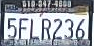</a> #1 · 0.871 | 5FLR236 | 5FLR236 ✓ | 5FLR236 ✓ |
| Fine-tuned | <a href="finetuned/crops/test__us_test_005.jpg__plate_01.png">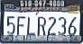</a> #1 · 0.921 | 5FLR236 | 5FLR236 ✓ | 5FLR236 ✓ |
| From scratch | No detections | — | — | — |

06 · us_test_006.jpg

**Original image**

**Reference:** HYMAIOS

| Pretrained | Fine-tuned | From scratch |
| --- | --- | --- |
| <a href="baseline/annotated/test__us_test_006.jpg.jpg">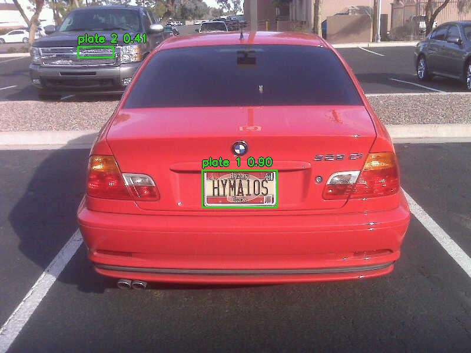</a> |  | <a href="scratch/annotated/test__us_test_006.jpg.jpg">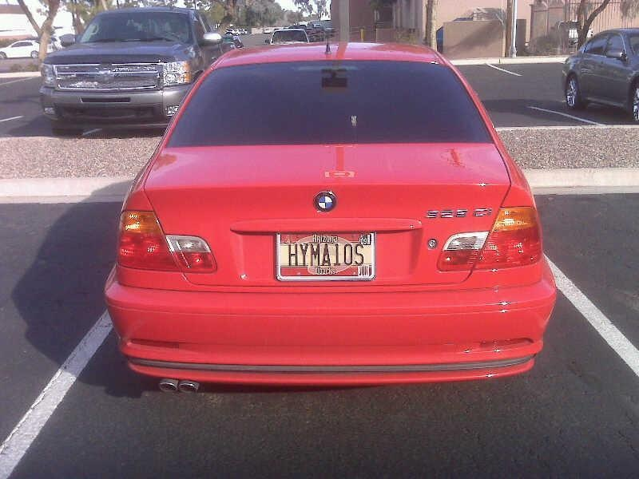</a> |
| 2 detections | 1 detection | 0 detections |

| Detector | Plate image and confidence | Reference | Original OCR | Fine-tuned OCR |
| --- | --- | --- | --- | --- |
| Pretrained |  #1 · 0.897 | HYMAIOS | LHYMATOS ✗ | HYMAIOS ✓ |
| Pretrained | <a href="baseline/crops/test__us_test_006.jpg__plate_02.png">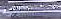</a> #2 · 0.415 | No matching plate | ALLON | 400 |
| Fine-tuned |  #1 · 0.933 | HYMAIOS | LHYMALOS ✗ | HYMA10S ✗ |
| From scratch | No detections | — | — | — |

07 · us_test_007.jpg

**Original image**

<a href="../data/images/test/us_test_007.jpg">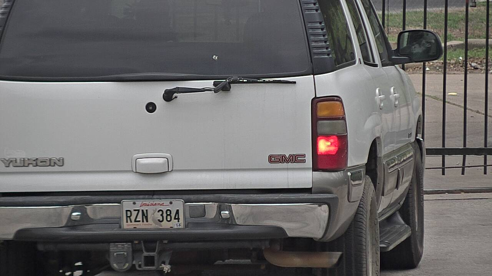</a>

**Reference:** RZN384

| Pretrained | Fine-tuned | From scratch |
| --- | --- | --- |
| <a href="baseline/annotated/test__us_test_007.jpg.jpg">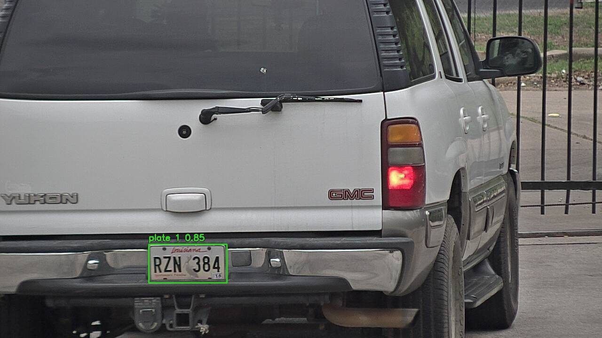</a> |  | <a href="scratch/annotated/test__us_test_007.jpg.jpg">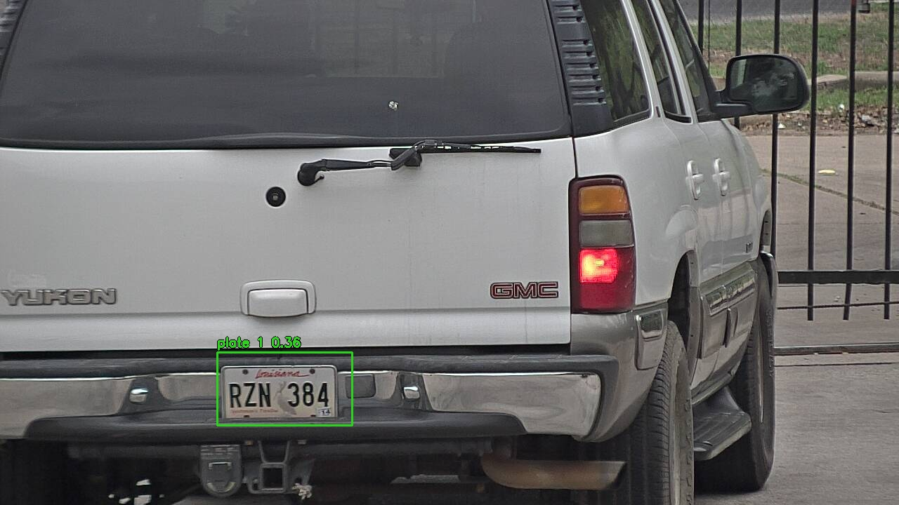</a> |
| 1 detection | 1 detection | 1 detection |

| Detector | Plate image and confidence | Reference | Original OCR | Fine-tuned OCR |
| --- | --- | --- | --- | --- |
| Pretrained | <a href="baseline/crops/test__us_test_007.jpg__plate_01.png">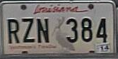</a> #1 · 0.850 | RZN384 | RZN384 ✓ | RZN384 ✓ |
| Fine-tuned | <a href="finetuned/crops/test__us_test_007.jpg__plate_01.png">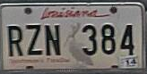</a> #1 · 0.917 | RZN384 | RZN384 ✓ | RZN384 ✓ |
| From scratch | <a href="scratch/crops/test__us_test_007.jpg__plate_01.png">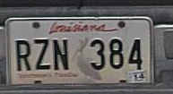</a> #1 · 0.362 | RZN384 | RZN384 ✓ | RZN384 ✓ |

08 · us_test_008.jpg

**Original image**

<a href="../data/images/test/us_test_008.jpg">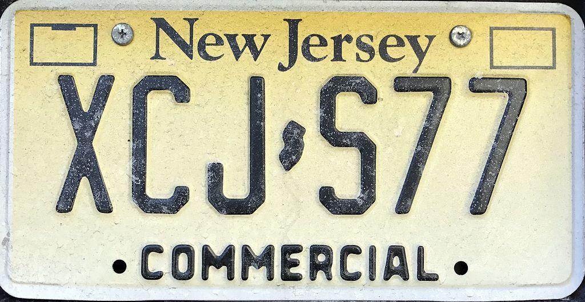</a>

**Reference:** XCJS77

| Pretrained | Fine-tuned | From scratch |
| --- | --- | --- |
| <a href="baseline/annotated/test__us_test_008.jpg.jpg">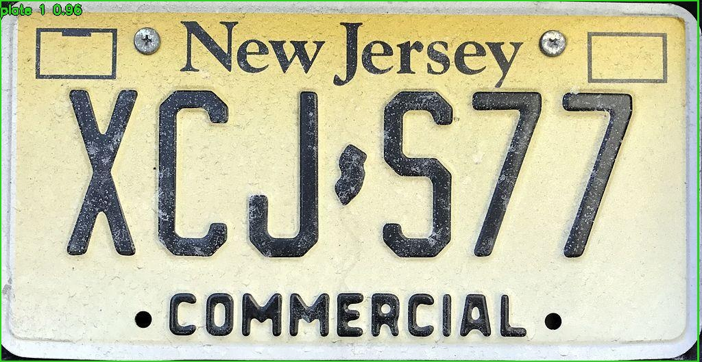</a> | <a href="finetuned/annotated/test__us_test_008.jpg.jpg">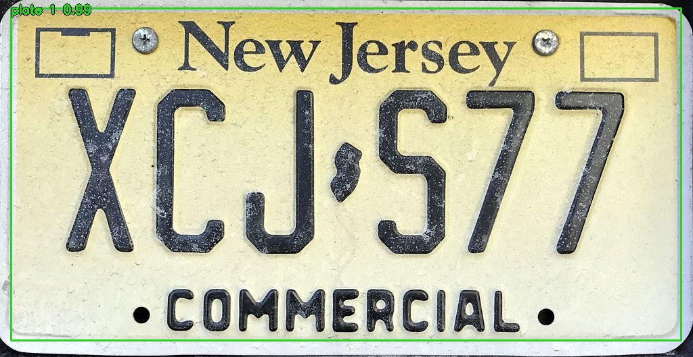</a> |  |
| 1 detection | 1 detection | 0 detections |

| Detector | Plate image and confidence | Reference | Original OCR | Fine-tuned OCR |
| --- | --- | --- | --- | --- |
| Pretrained |  #1 · 0.957 | XCJS77 | XCJS77 ✓ | XCJ577 ✗ |
| Fine-tuned | <a href="finetuned/crops/test__us_test_008.jpg__plate_01.png">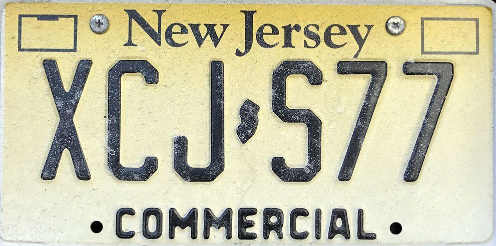</a> #1 · 0.988 | XCJS77 | XCJS77 ✓ | XCJS77 ✓ |
| From scratch | No detections | — | — | — |

09 · us_test_009.jpg

**Original image**

**Reference:** 1AMW240

| Pretrained | Fine-tuned | From scratch |
| --- | --- | --- |
|  |  |  |
| 1 detection | 1 detection | 0 detections |

| Detector | Plate image and confidence | Reference | Original OCR | Fine-tuned OCR |
| --- | --- | --- | --- | --- |
| Pretrained |  #1 · 0.901 | 1AMW240 | 1AMM240 ✗ | 1AMW240 ✓ |
| Fine-tuned |  #1 · 0.915 | 1AMW240 | 1AMW240 ✓ | 1AMW240 ✓ |
| From scratch | No detections | — | — | — |

10 · us_test_010.jpg

**Original image**

<a href="../data/images/test/us_test_010.jpg">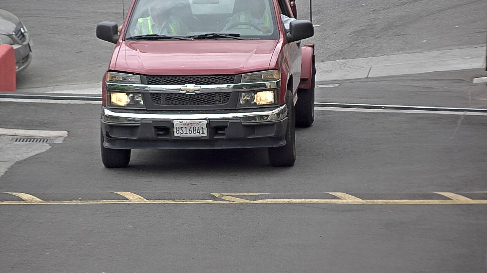</a>

**Reference:** 8S16841

| Pretrained | Fine-tuned | From scratch |
| --- | --- | --- |
| <a href="baseline/annotated/test__us_test_010.jpg.jpg">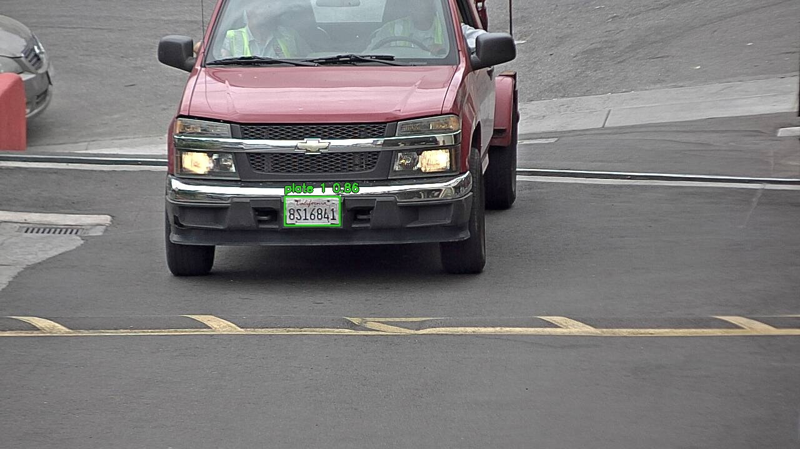</a> |  | <a href="scratch/annotated/test__us_test_010.jpg.jpg">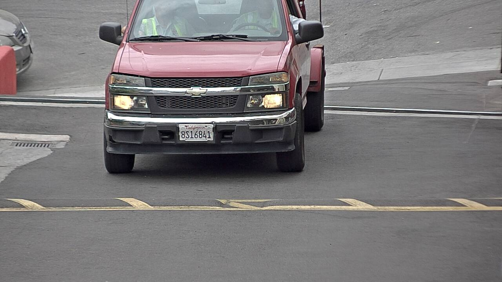</a> |
| 1 detection | 1 detection | 0 detections |

| Detector | Plate image and confidence | Reference | Original OCR | Fine-tuned OCR |
| --- | --- | --- | --- | --- |
| Pretrained |  #1 · 0.860 | 8S16841 | 8S16841 ✓ | 8S16841 ✓ |
| Fine-tuned |  #1 · 0.918 | 8S16841 | 8S16841 ✓ | 8S16841 ✓ |
| From scratch | No detections | — | — | — |

11 · us_test_011.jpg

**Original image**

<a href="../data/images/test/us_test_011.jpg">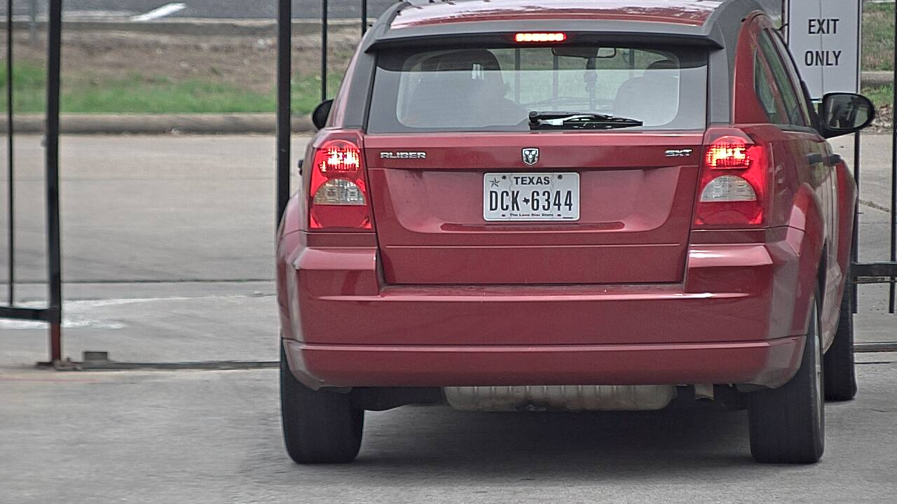</a>

**Reference:** DCK6344

| Pretrained | Fine-tuned | From scratch |
| --- | --- | --- |
| <a href="baseline/annotated/test__us_test_011.jpg.jpg">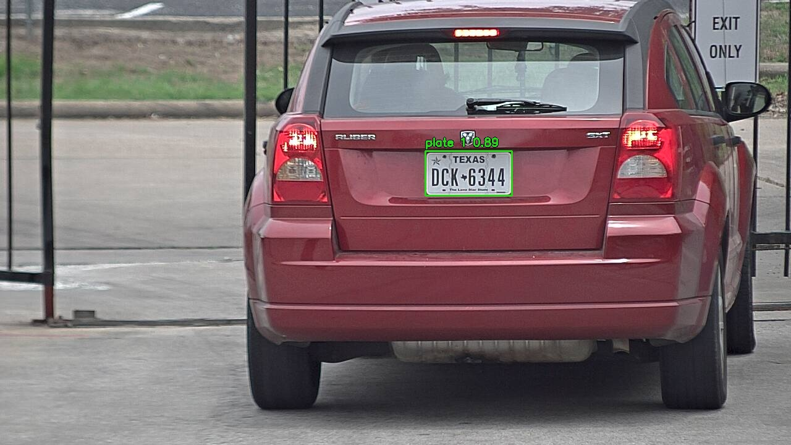</a> | <a href="finetuned/annotated/test__us_test_011.jpg.jpg">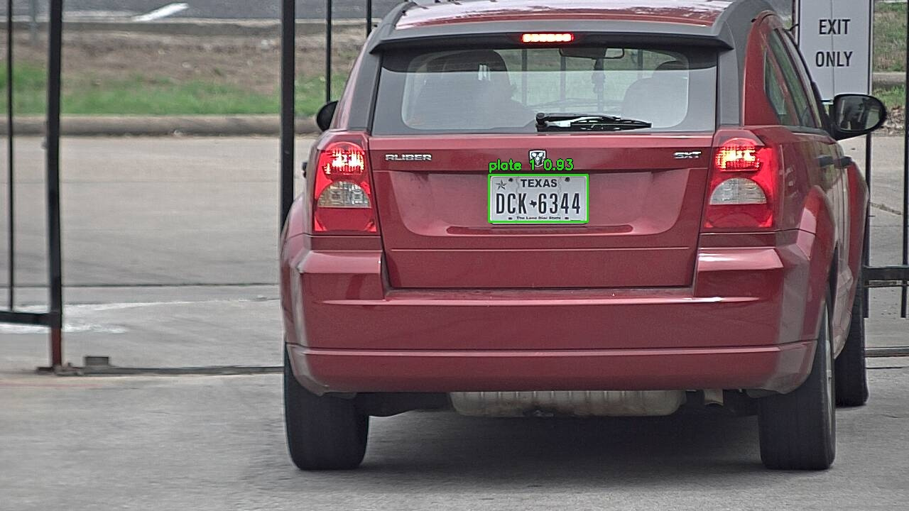</a> | <a href="scratch/annotated/test__us_test_011.jpg.jpg">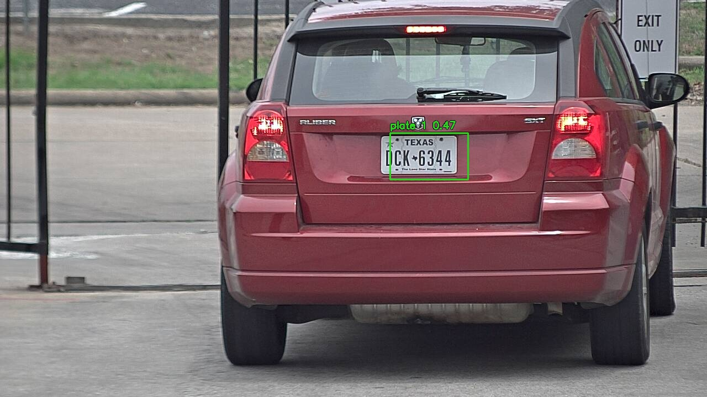</a> |
| 1 detection | 1 detection | 1 detection |

| Detector | Plate image and confidence | Reference | Original OCR | Fine-tuned OCR |
| --- | --- | --- | --- | --- |
| Pretrained |  #1 · 0.893 | DCK6344 | DCK6344 ✓ | DCK6344 ✓ |
| Fine-tuned |  #1 · 0.932 | DCK6344 | DCK6344 ✓ | DCK6344 ✓ |
| From scratch |  #1 · 0.467 | DCK6344 | DCK6344 ✓ | DCK6344 ✓ |

12 · us_test_012.jpg

**Original image**

**Reference:** WATTUP

| Pretrained | Fine-tuned | From scratch |
| --- | --- | --- |
|  | <a href="finetuned/annotated/test__us_test_012.jpg.jpg">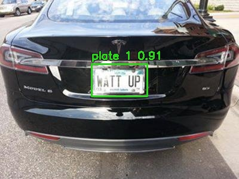</a> |  |
| 1 detection | 1 detection | 0 detections |

| Detector | Plate image and confidence | Reference | Original OCR | Fine-tuned OCR |
| --- | --- | --- | --- | --- |
| Pretrained |  #1 · 0.907 | WATTUP | WATTUP ✓ | WATTUP ✓ |
| Fine-tuned |  #1 · 0.913 | WATTUP | WATTUP ✓ | WATTUP ✓ |
| From scratch | No detections | — | — | — |

13 · us_test_013.jpg

**Original image**

<a href="../data/images/test/us_test_013.jpg">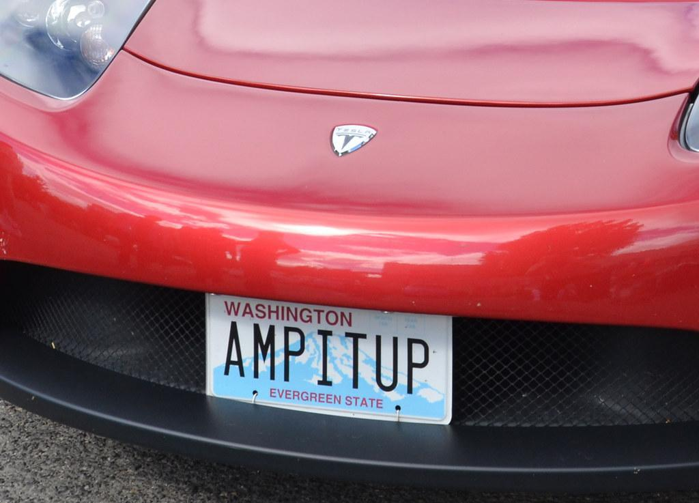</a>

**Reference:** AMPITUP

| Pretrained | Fine-tuned | From scratch |
| --- | --- | --- |
|  | <a href="finetuned/annotated/test__us_test_013.jpg.jpg">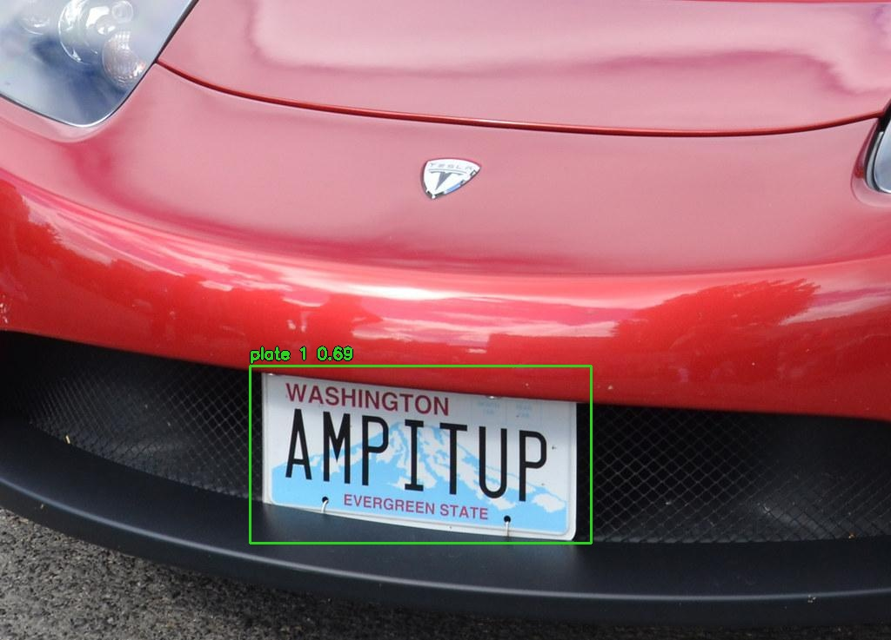</a> | <a href="scratch/annotated/test__us_test_013.jpg.jpg">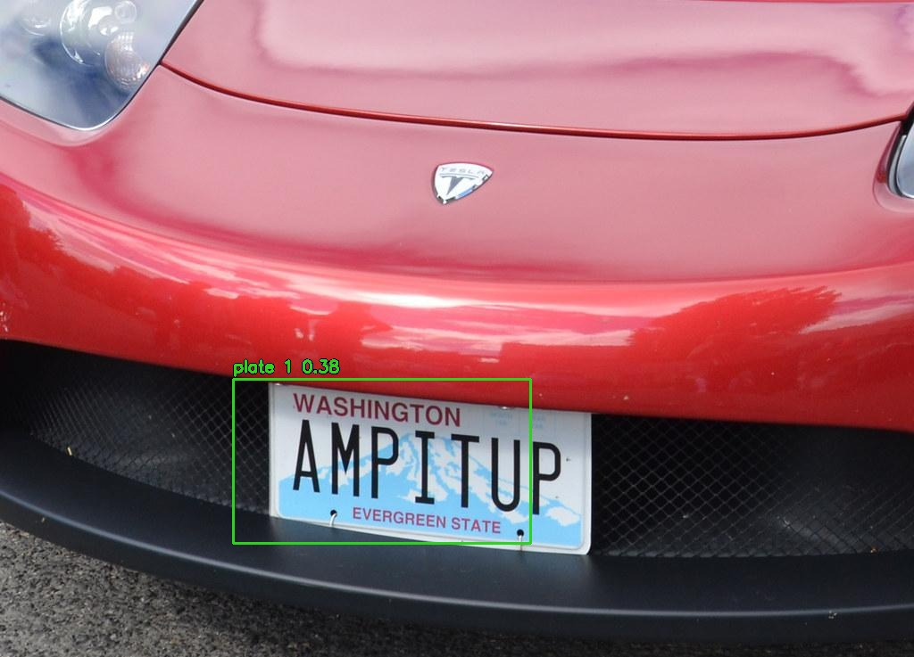</a> |
| 1 detection | 1 detection | 1 detection |

| Detector | Plate image and confidence | Reference | Original OCR | Fine-tuned OCR |
| --- | --- | --- | --- | --- |
| Pretrained | <a href="baseline/crops/test__us_test_013.jpg__plate_01.png">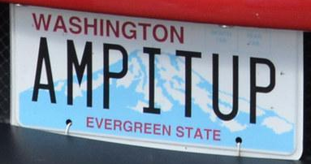</a> #1 · 0.893 | AMPITUP | AMPITUP ✓ | AMPITUP ✓ |
| Fine-tuned |  #1 · 0.687 | AMPITUP | AMPITUP ✓ | AMPITUP ✓ |
| From scratch | <a href="scratch/crops/test__us_test_013.jpg__plate_01.png">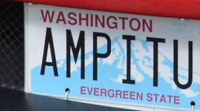</a> #1 · 0.382 | AMPITUP | AMPITU ✗ | AMPITU ✗ |

14 · us_test_014.jpg

**Original image**

**Reference:** WTC249

| Pretrained | Fine-tuned | From scratch |
| --- | --- | --- |
|  |  | <a href="scratch/annotated/test__us_test_014.jpg.jpg">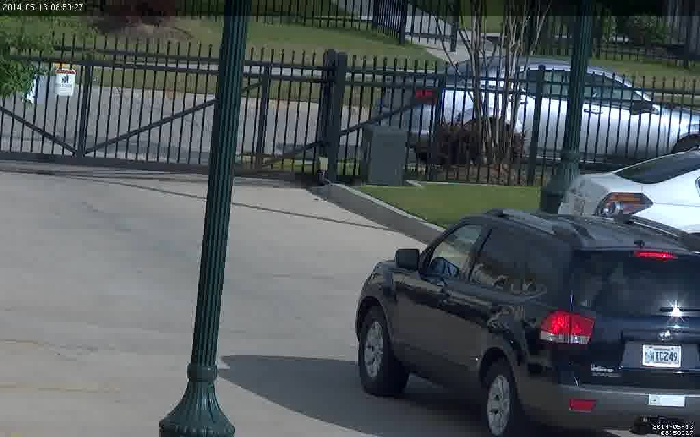</a> |
| 1 detection | 1 detection | 0 detections |

| Detector | Plate image and confidence | Reference | Original OCR | Fine-tuned OCR |
| --- | --- | --- | --- | --- |
| Pretrained | <a href="baseline/crops/test__us_test_014.jpg__plate_01.png">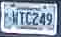</a> #1 · 0.862 | WTC249 | WTC249 ✓ | WTC249 ✓ |
| Fine-tuned | <a href="finetuned/crops/test__us_test_014.jpg__plate_01.png">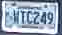</a> #1 · 0.890 | WTC249 | MTC249 ✗ | WTC249 ✓ |
| From scratch | No detections | — | — | — |

15 · us_test_015.jpg

**Original image**

<a href="../data/images/test/us_test_015.jpg">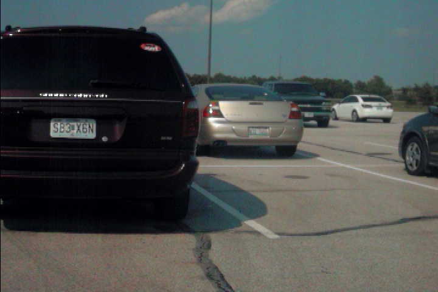</a>

**Reference:** SB3X6N

| Pretrained | Fine-tuned | From scratch |
| --- | --- | --- |
| <a href="baseline/annotated/test__us_test_015.jpg.jpg">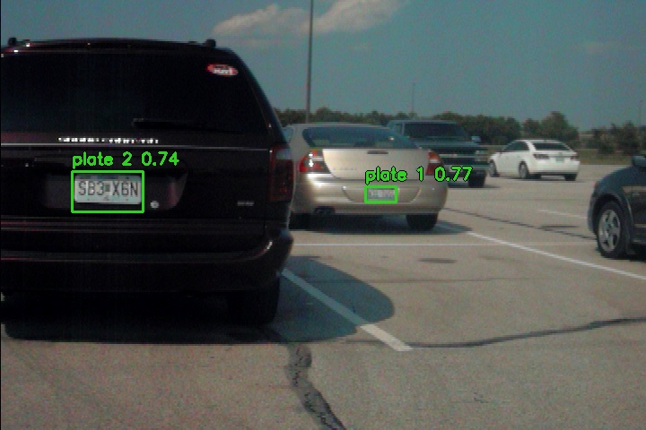</a> | <a href="finetuned/annotated/test__us_test_015.jpg.jpg">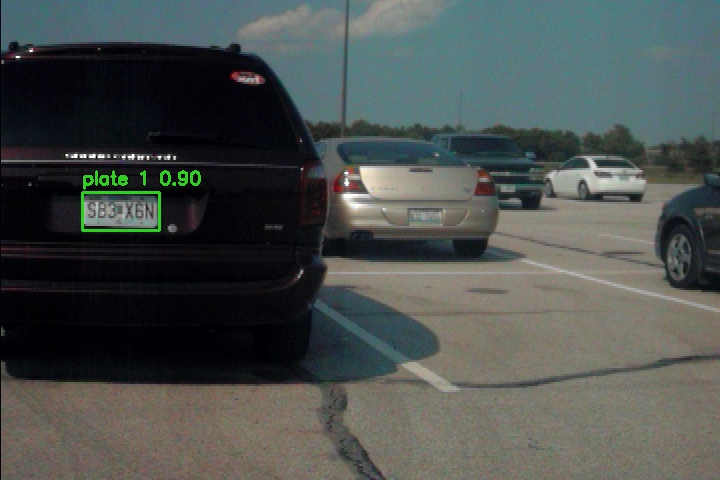</a> |  |
| 2 detections | 1 detection | 0 detections |

| Detector | Plate image and confidence | Reference | Original OCR | Fine-tuned OCR |
| --- | --- | --- | --- | --- |
| Pretrained | <a href="baseline/crops/test__us_test_015.jpg__plate_01.png">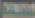</a> #1 · 0.766 | No matching plate | THEMISH | 7974 |
| Pretrained | <a href="baseline/crops/test__us_test_015.jpg__plate_02.png">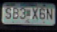</a> #2 · 0.742 | SB3X6N | SB3X6N ✓ | SB3X6N ✓ |
| Fine-tuned | <a href="finetuned/crops/test__us_test_015.jpg__plate_01.png">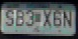</a> #1 · 0.899 | SB3X6N | SB3X6N ✓ | SB3X6N ✓ |
| From scratch | No detections | — | — | — |

16 · us_test_016.jpg

**Original image**

**Reference:** 9185914

| Pretrained | Fine-tuned | From scratch |
| --- | --- | --- |
| <a href="baseline/annotated/test__us_test_016.jpg.jpg">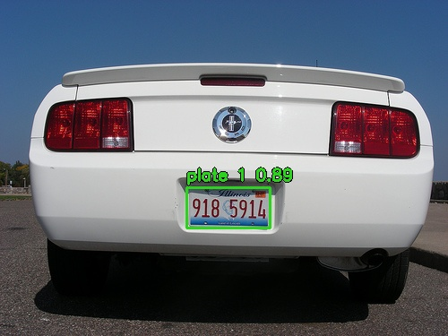</a> |  | <a href="scratch/annotated/test__us_test_016.jpg.jpg">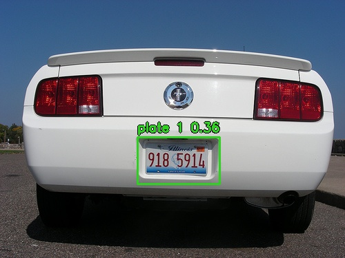</a> |
| 1 detection | 1 detection | 1 detection |

| Detector | Plate image and confidence | Reference | Original OCR | Fine-tuned OCR |
| --- | --- | --- | --- | --- |
| Pretrained |  #1 · 0.891 | 9185914 | 9185914 ✓ | 9185914 ✓ |
| Fine-tuned |  #1 · 0.919 | 9185914 | 9185914 ✓ | 9185914 ✓ |
| From scratch |  #1 · 0.364 | 9185914 | 9185914 ✓ | 9185914 ✓ |

17 · us_test_017.jpg

**Original image**

<a href="../data/images/test/us_test_017.jpg">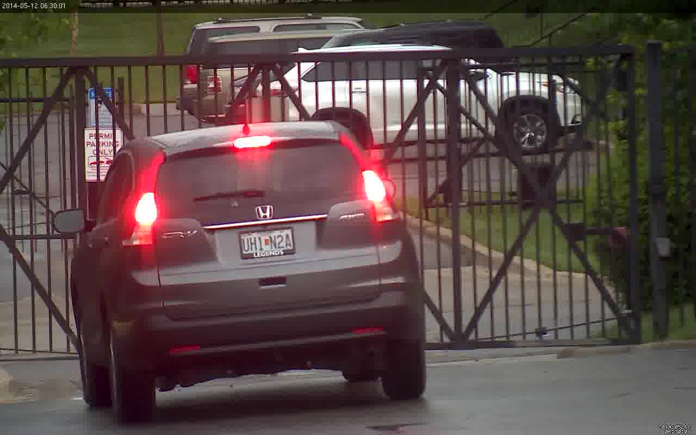</a>

**Reference:** UH1N2A

| Pretrained | Fine-tuned | From scratch |
| --- | --- | --- |
| <a href="baseline/annotated/test__us_test_017.jpg.jpg">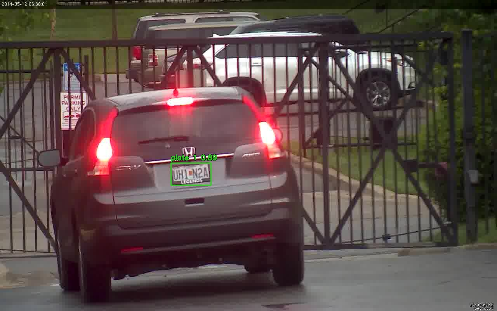</a> |  |  |
| 1 detection | 1 detection | 0 detections |

| Detector | Plate image and confidence | Reference | Original OCR | Fine-tuned OCR |
| --- | --- | --- | --- | --- |
| Pretrained |  #1 · 0.886 | UH1N2A | UH1N2A ✓ | UH1N2A ✓ |
| Fine-tuned |  #1 · 0.899 | UH1N2A | UH1N2A ✓ | UH1N2A ✓ |
| From scratch | No detections | — | — | — |

18 · us_test_018.jpg

**Original image**

**Reference:** LOLNOOB

| Pretrained | Fine-tuned | From scratch |
| --- | --- | --- |
|  |  |  |
| 1 detection | 1 detection | 1 detection |

| Detector | Plate image and confidence | Reference | Original OCR | Fine-tuned OCR |
| --- | --- | --- | --- | --- |
| Pretrained |  #1 · 0.894 | LOLNOOB | LOLNOOB ✓ | LOLNOOB ✓ |
| Fine-tuned |  #1 · 0.928 | LOLNOOB | LOLNOOB ✓ | LOLNOOB ✓ |
| From scratch |  #1 · 0.476 | LOLNOOB | OLNOOB ✗ | OLNOOB ✗ |

19 · us_test_019.jpg

**Original image**

<a href="../data/images/test/us_test_019.jpg">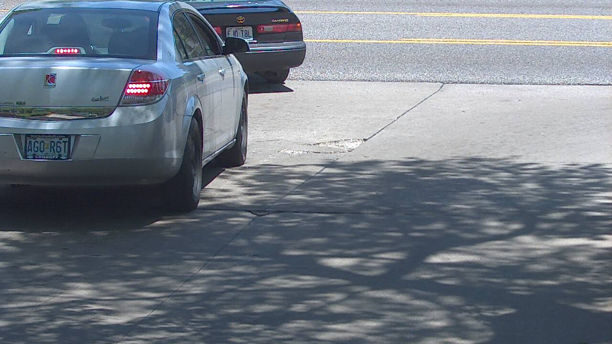</a>

**Reference:** AG0R6T

| Pretrained | Fine-tuned | From scratch |
| --- | --- | --- |
| <a href="baseline/annotated/test__us_test_019.jpg.jpg">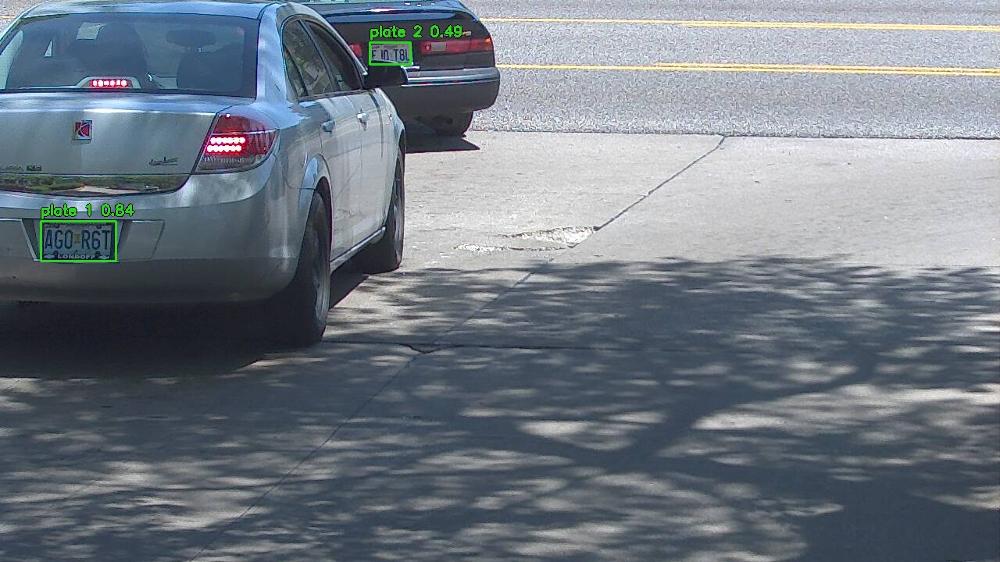</a> | <a href="finetuned/annotated/test__us_test_019.jpg.jpg">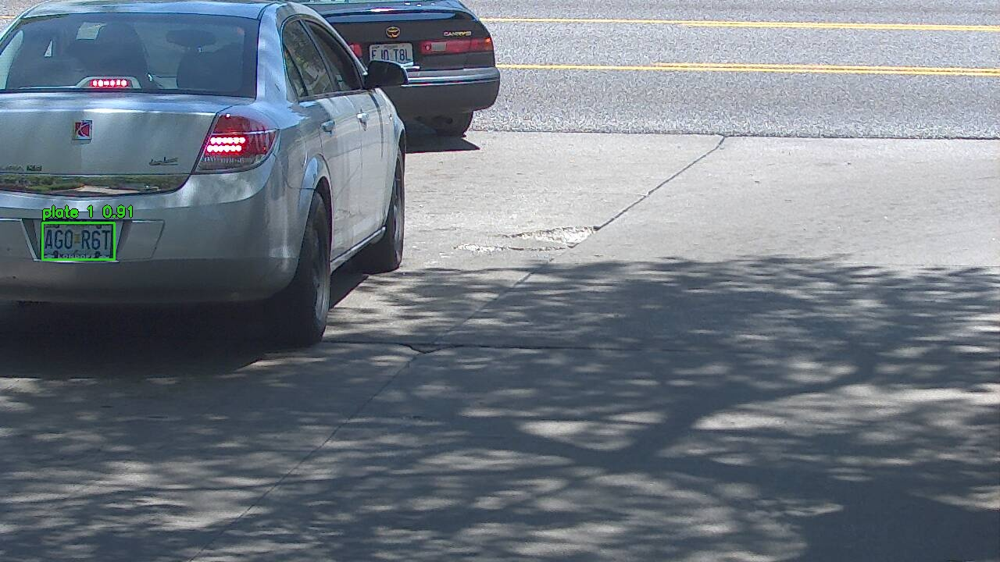</a> |  |
| 2 detections | 1 detection | 0 detections |

| Detector | Plate image and confidence | Reference | Original OCR | Fine-tuned OCR |
| --- | --- | --- | --- | --- |
| Pretrained | <a href="baseline/crops/test__us_test_019.jpg__plate_01.png">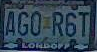</a> #1 · 0.844 | AG0R6T | AGOR6T ✗ | AGOR6T ✗ |
| Pretrained | <a href="baseline/crops/test__us_test_019.jpg__plate_02.png">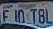</a> #2 · 0.488 | No matching plate | FINT8L | FINT8L |
| Fine-tuned |  #1 · 0.905 | AG0R6T | AGOR6T ✗ | AGOR6T ✗ |
| From scratch | No detections | — | — | — |

20 · us_test_020.jpg

**Original image**

<a href="../data/images/test/us_test_020.jpg">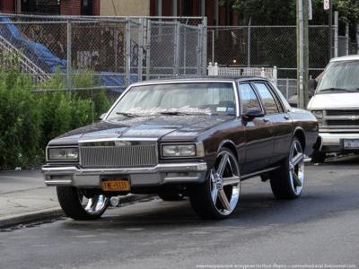</a>

**Reference:** Not labeled

| Pretrained | Fine-tuned | From scratch |
| --- | --- | --- |
|  | <a href="finetuned/annotated/test__us_test_020.jpg.jpg">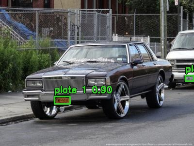</a> |  |
| 2 detections | 2 detections | 0 detections |

| Detector | Plate image and confidence | Reference | Original OCR | Fine-tuned OCR |
| --- | --- | --- | --- | --- |
| Pretrained | <a href="baseline/crops/test__us_test_020.jpg__plate_01.png">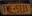</a> #1 · 0.884 | Not labeled | INESUI | MESUI |
| Pretrained | <a href="baseline/crops/test__us_test_020.jpg__plate_02.png">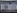</a> #2 · 0.756 | No matching plate | 08 | 00 |
| Fine-tuned | <a href="finetuned/crops/test__us_test_020.jpg__plate_01.png">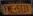</a> #1 · 0.897 | Not labeled | FNE501 | FM501 |
| Fine-tuned |  #2 · 0.332 | No matching plate | 00 | 00 |
| From scratch | No detections | — | — | — |

## Sources

- Models: [YOLOv9-t plate detector](https://github.com/ankandrew/open-image-models) and [PARSeq-Tiny](https://github.com/baudm/parseq).
- Data: [OpenALPR US benchmark](https://github.com/openalpr/benchmarks/tree/9790ed20d475be1e940a7e2a3f492a97c2ebed9b/endtoend/us) and [Roboflow License Plate Recognition](https://universe.roboflow.com/roboflow-universe-projects/license-plate-recognition-rxg4e) ([Kaggle download](https://www.kaggle.com/datasets/adilshamim8/license-plate-recognition)).

Generated from `results/detections.json` with `python export_results.py`.
